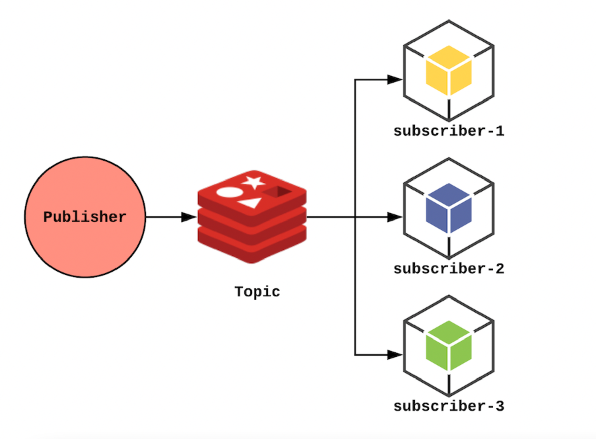

## In Memory Cache Synchronization Via Redis
This is a project that owns basic in memory cache implementation, and exposes some API's to the outside. It uses in memory cache for returning responses. 

When we dockerized the application and running multiple instances from this image, in memory cache's can not be consistent.

I used redis pub-sub mechanism for provide cache consistency. Whenever an instance takes and request, it completes the operation, then publishes a message to the redis channel. Other instances consumes this message and updates their own in memory caches. 

